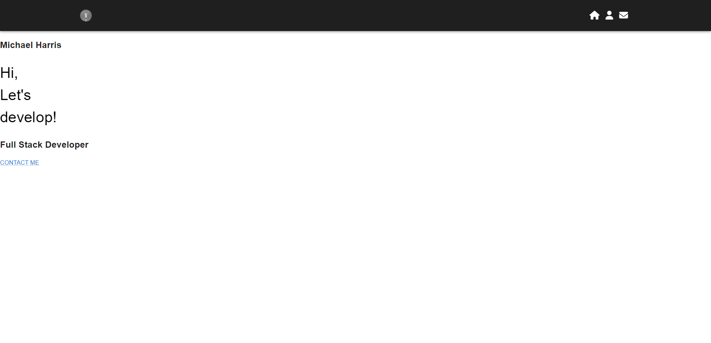

# Portfolio

## Table of contents

- [Overview](#overview)
  - [The challenge](#the-challenge)
  - [User Story](#user-story)
  - [Acceptance Criteria](#acceptance-criteria)
  - [Screenshot](#screenshot)
  - [Links](#links)
- [My process](#my-process)
  - [Built with](#built-with)
  - [What I learned](#what-i-learned)
  - [Continued development](#continued-development)
  - [Useful resources](#useful-resources)
- [Author](#author)

## Overview

### The challenge

Being a web developer means being part of a community. You’ll need a place not only to share your projects while you're applying for jobs or working as a freelancer but also to share your work with other developers and collaborate on projects.

Your task is to create a portfolio using your new React skills, which will help set you apart from other developers whose portfolios don’t use the latest technologies.

You’ll deploy this application to GitHub Pages. Follow the instructions in the Git Guide or consult the Create React App Docs on GitHub Pages to create a build that you can deploy.

Important: Be sure to push your codebase to the default branch in GitHub -- NOT your built and deployed code. Ensure this happens by using the gh-pages branch to host the deployed application's build.

### User Story

AS AN employer looking for candidates with experience building single-page applications
I WANT to view a potential employee's deployed React portfolio of work samples
SO THAT I can assess whether they're a good candidate for an open position

### Acceptance Criteria

```md
GIVEN a single-page application portfolio for a web developer
WHEN I load the portfolio
THEN I am presented with a page containing a header, a section for content, and a footer
WHEN I view the header
THEN I am presented with the developer's name and navigation with titles corresponding to different sections of the portfolio
WHEN I view the navigation titles
THEN I am presented with the titles About Me, Portfolio, Contact, and Resume, and the title corresponding to the current section is highlighted
WHEN I click on a navigation title
THEN I am presented with the corresponding section below the navigation without the page reloading and that title is highlighted
WHEN I load the portfolio the first time
THEN the About Me title and section are selected by default
WHEN I am presented with the About Me section
THEN I see a recent photo or avatar of the developer and a short bio about them
WHEN I am presented with the Portfolio section
THEN I see titled images of six of the developer’s applications with links to both the deployed applications and the corresponding GitHub repositories
WHEN I am presented with the Contact section
THEN I see a contact form with fields for a name, an email address, and a message
WHEN I move my cursor out of one of the form fields without entering text
THEN I receive a notification that this field is required
WHEN I enter text into the email address field
THEN I receive a notification if I have entered an invalid email address
WHEN I am presented with the Resume section
THEN I see a link to a downloadable resume and a list of the developer’s proficiencies
WHEN I view the footer
THEN I am presented with text or icon links to the developer’s GitHub and LinkedIn profiles, and their profile on a third platform (Stack Overflow, Twitter)
```

### Screenshot

.png>)


### Links

- Solution URL: [GitHub](https://github.com/Snufalufakis/FeelingTheBurn)
- Live Site URL: [Add live site URL here](https://your-live-site-url.com)

## My process

### Built with

- CSS
- JavaScript
- React
- Material Ui
- Emailjs

### What I learned

Use this section to recap over some of your major learnings while working through this project. Writing these out and providing code samples of areas you want to highlight is a great way to reinforce your own knowledge.

To see how you can add code snippets, see below:

```html
<h1>Some HTML code I'm proud of</h1>
```

```css
import { Outlet } from "react-router-dom";
 Helped me with routing soo much otherwise i
 don't think i could get routes to work with nav bar.

const Layout = () => {
  return (
    <div className="App">
      <Navbar />
      <div>
        <Outlet />
        <br />
      </div>
    </div>
  );
};

export default Layout;
```

### Continued development

Material Ui - I will have to spend more time using this ui its till hard for me to understand the documentation.

### Useful resources

- [Material Ui](https://mui.com/material-ui/getting-started/overview/) - Main source of material for this project
- [stackoverflow](stackoverflow.com)
  -for all errors and warnings

## Author

- Website - [Github](https://github.com/Snufalufakis)
- Twitter - [@Snufalufakis2](https://www.twitter.com/Snufalufakis2)
